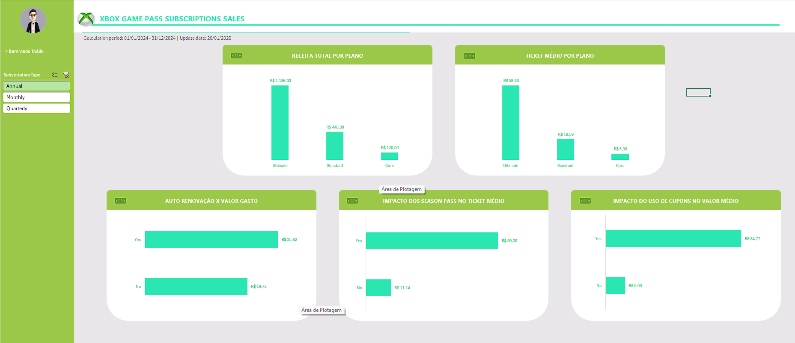

# 📊 Excel Business Analysis Dashboard

## 📌 Objetivo
Este projeto tem como objetivo analisar dados de assinaturas e responder às principais perguntas de negócio relacionadas à receita, retenção de clientes e estratégias de monetização, utilizando o Excel como ferramenta principal.

O foco é transformar dados brutos em insights claros e acionáveis, com visualizações simples e orientadas à tomada de decisão.

---

## 📊 Dashboard Preview

---

## 📂 Base de Dados
A base de dados contém informações sobre:
- Plano contratado
- Tipo de assinatura
- Valor da assinatura
- Auto renovação
- Valor de cupom aplicado
- Season Pass (EA Play e Minecraft)
- Valor total gasto por cliente

Algumas informações de negócio (como uso de cupom e presença de Season Pass) foram derivadas a partir dos dados originais.

---

## ❓ Perguntas de Negócio Respondidas

1. Qual plano gera mais receita total?
2. Qual plano possui o maior ticket médio por cliente?
3. Clientes com auto renovação gastam mais?
4. O uso de Season Pass impacta o valor total gasto?
5. Cupons aumentam o ticket médio ou apenas reduzem receita?

---

## 📈 Análises e Visualizações
O dashboard foi construído com foco em clareza e valor de negócio, utilizando:
- Tabelas dinâmicas
- Gráficos de colunas
- Métricas de soma e média
- Campos derivados para regras de negócio

As visualizações estão organizadas para responder às perguntas de negócio de forma direta e intuitiva.

---

## 🔍 Principais Insights

- O plano **Ultimate** é o principal gerador de receita total e apresenta o maior ticket médio por cliente.
- Clientes com **auto renovação ativa** possuem maior valor médio gasto, reforçando a importância de estratégias de retenção.
- A presença de **Season Pass (EA Play ou Minecraft)** impacta positivamente o valor total gasto por cliente.
- O uso de **cupons** não apresenta aumento proporcional no ticket médio, atuando principalmente como incentivo à adesão inicial.

---

## 🛠️ Ferramentas Utilizadas
- Microsoft Excel
  - Tabelas dinâmicas
  - Gráficos
  - Campos derivados

---

## 📌 Observações
Algumas análises podem sofrer variações devido ao tamanho da amostra por plano, o que foi considerado durante a interpretação dos resultados.

---

## 👤 Autor
**Thálik Andrade Parente**
